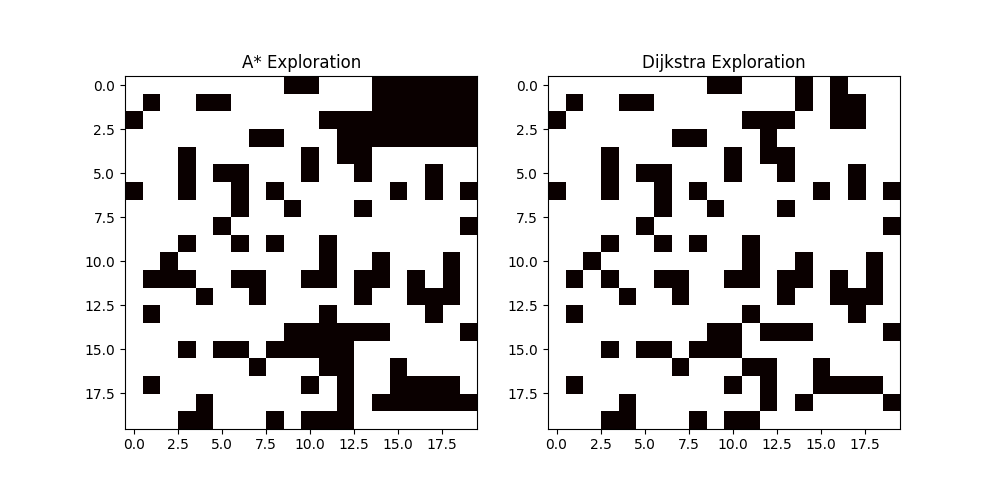
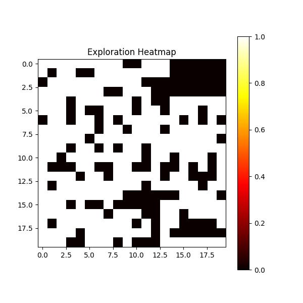
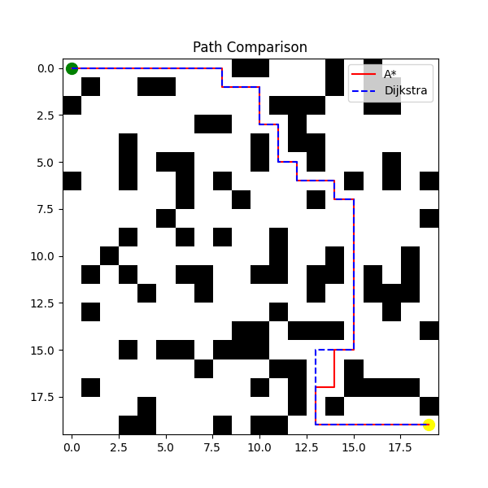
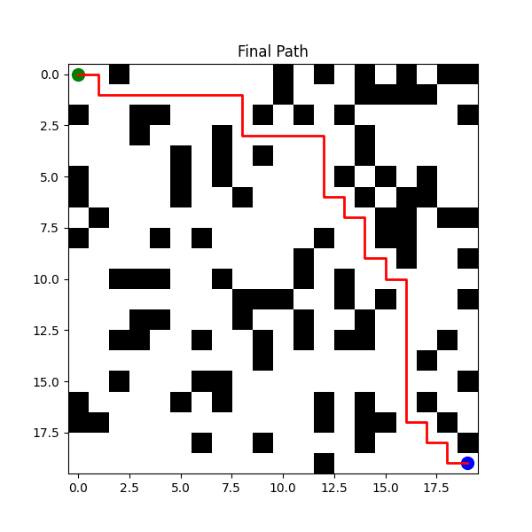

AI-based autonomous navigation system using A* path planning with simulation and visualization
=======
# 🚀 AI-Based Autonomous Navigation System (Simulation)

## 📌 Project Overview

This project simulates an **AI-based autonomous navigation system** where a virtual robot navigates from a start position to a goal while avoiding obstacles using the **A* path planning algorithm**.

The system is built entirely in a **virtual environment**, making it lightweight, scalable, and ideal for demonstrating real-world autonomous navigation concepts without hardware.

---

## 🎯 Problem Statement

Autonomous systems such as self-driving cars and delivery robots must navigate safely in environments with obstacles.

This project solves:

* Path planning in a grid environment
* Obstacle avoidance
* Real-time movement simulation

---

## 🌍 Industry Relevance

This project reflects core concepts used in:

* 🚗 Self-driving cars (Tesla, Waymo)
* 🤖 Warehouse robots (Amazon Robotics)
* 🚁 Drones navigation
* 🏭 Industrial automation systems

---

## ⚙️ Tech Stack

* Python
* NumPy
* Matplotlib
* OpenCV (for basic perception)
* Pygame (optional simulation UI)

---

## 🧠 System Architecture

```
Grid Environment → Obstacle Generation → A* Path Planning → Movement Simulation → Output Saving
```

---

## 📁 Project Structure

```
AI-Autonomous-Navigation-System/
│
├── src/
│   ├── main.py
│   ├── grid.py
│   ├── obstacles.py
│   ├── astar.py
│   ├── visualization.py
│   ├── vision.py
│   └── saver.py
│
├── outputs/
│   ├── images/
│   ├── frames/
│   └── logs/
│
├── requirements.txt
├── README.md
└── .gitignore
```

---

## 🚀 How to Run

### 1️⃣ Clone the Repository

```bash
git clone https://github.com/your-username/AI-Autonomous-Navigation-System.git
cd AI-Autonomous-Navigation-System
```

### 2️⃣ Install Dependencies

```bash
pip install -r requirements.txt
```

### 3️⃣ Run the Simulation

```bash
python src/main.py
```

---

## 🎬 Features

✅ 2D Grid Environment
✅ Random Obstacle Generation
✅ A* Path Planning Algorithm
✅ Real-Time Movement Simulation
✅ Output Saving (Images, Frames, Logs)
✅ Basic Computer Vision (OpenCV)

## 🎮 Controls

- SPACE → Start / Pause
- A → A* Algorithm
- D → Dijkstra Algorithm
- R → Reset Simulation
- ESC → Exit

---

## 📸 Screenshots

## 📊 Analytics & Visualization

### 🔍 Exploration Comparison (A* vs Dijkstra)


---

### 🔥 Exploration Heatmap


---

### 📍 Path Comparison


---

### ⚡ Performance Comparison


### 🔹 Path Planning



### 🔹 Simulation Frames

*(Add frames from outputs/frames folder)*

---

## 📊 Output Files

* 📸 `outputs/images/final_path.png`
* 🎬 `outputs/frames/`
* 📄 `outputs/logs/path_log.txt`

---

## 🧪 Sample Output

```
Path Found!
Path Length: 42
Simulation Started...
```

---

## 🔮 Future Improvements

* 🔹 Integrate YOLO object detection
* 🔹 Add reinforcement learning
* 🔹 Implement SLAM (Simultaneous Localization and Mapping)
* 🔹 Integrate with CARLA / ROS
* 🔹 Multi-agent navigation

---

## 📚 Learning Outcomes

* Path planning algorithms (A*)
* Simulation design
* Computer vision basics
* Modular Python architecture
* Real-world robotics concepts

---

## 👨‍💻 Author

**Rohit Mahadhane**
AI & Software Engineering Enthusiast

---

## ⭐ Show Your Support

If you found this project useful:

* ⭐ Star the repository
* 🍴 Fork it
* 📢 Share it

---

